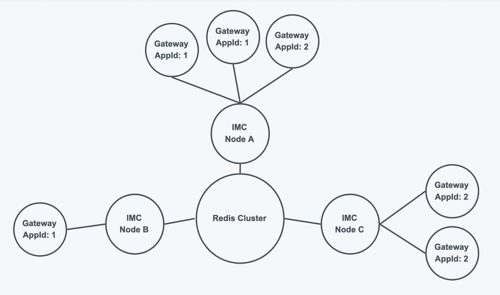

# IMC Message Center 
## 通讯中台-消息推送中心
### `消息中台系统`

本项目是对 https://github.com/dpwgc/fast-im 项目的重构
（由 MVC 架构转为 DDD + CQRS 架构）

### [HTTP接口文档：HTTP_API.md](./HTTP_API.md)
### [WebSocket连接文档：WS.md](./WS.md)
***

### 项目架构
* 基础架构：基于 Spring Boot 结合 DDD 领域驱动设计及 CQRS 架构实现（代码层面实现读写分离，底层数据存储不分离）
* 数据库：MariaDB（可换成 MySQL，两者通用）
* 消息队列：Redis Stream
* 分布式消息广播推送：基于 Redis 订阅/发布功能 + Spring WebSocket 实现

***

### 实现功能
* 群聊消息广播发送（HTTP、WS）
* 群聊消息广播撤回（HTTP）
* 群聊消息查询（HTTP）
* 群聊通知发布、删除与查询（HTTP）

***

### 架构图与流程图
* 部署架构图

可以部署多个IMC通讯中台，所有中台连接到同一个Redis和MariaDB源，每个中台连接任意数量的网关（自行分配）。

* 消息发送与撤回流程

用户在APP端或者Web端发出消息，消息传入网关（用户端与网关请自行实现，本项目主要关注网关与中台的连接）。
网关再通过WebSocket连接将消息传入IMC通讯中台（连接方式见文档WS.md）。
中台将消息写入Redis Stream消息队列，然后再通过Redis Pub/Sub广播消息给所有持有相同appId的IMC通讯中台节点。
各个IMC通讯中台节点收到广播发来的消息后，再把这个消息推送给与自己连接的网关。
各个网关收到IMC通讯中台推送的消息后，再将消息推送给用户（该步骤自行实现）。

***

### 项目结构

#### 垂直分层

* message-center-sdk `存放一些ui层要用到的实体类（例如DTO对象、Command对象）`
* message-center-ui `用户接口层（表示层，包括接口服务及配置服务）`
* message-center-app `应用层（对下层传来的对象进行业务处理，再传给上层）`
* message-center-domain `领域层（负责组装基础服务层传来的数据对象）`
* message-center-infrastructure `基础服务层（包括数据库交互、缓存交互以及一些工具类）`

#### 水平分区

##### 读写分区
* command `写入服务`
* query `查询服务`

##### 服务分区
* chat `聊天模块`
  * message `聊天消息服务`
* notice `通知模块`
  * information `通知信息服务`

